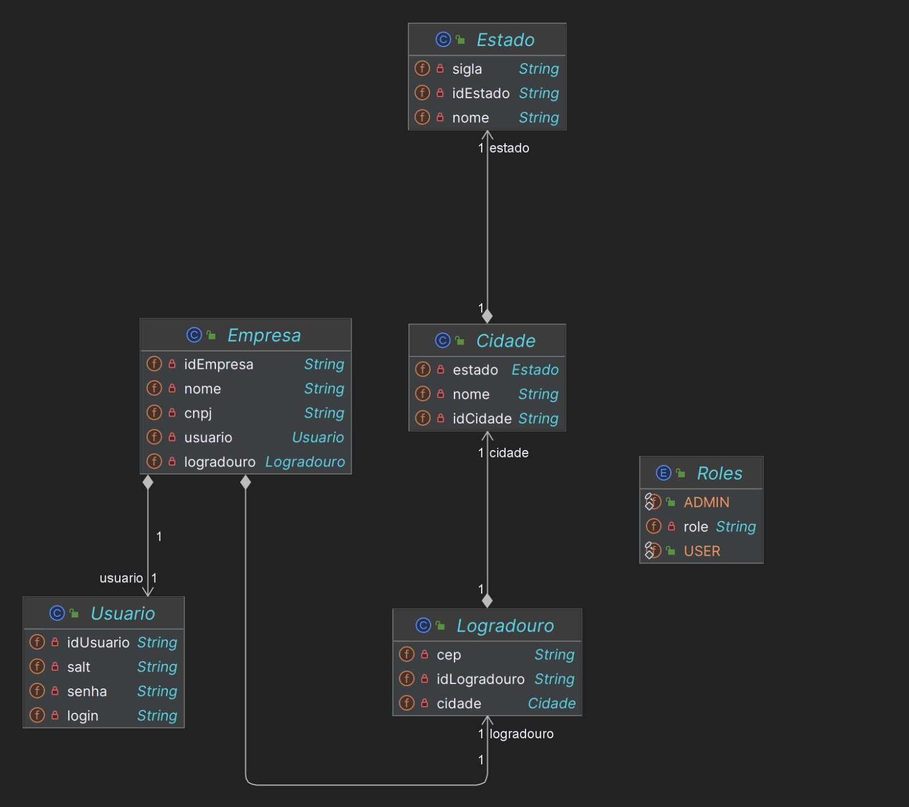
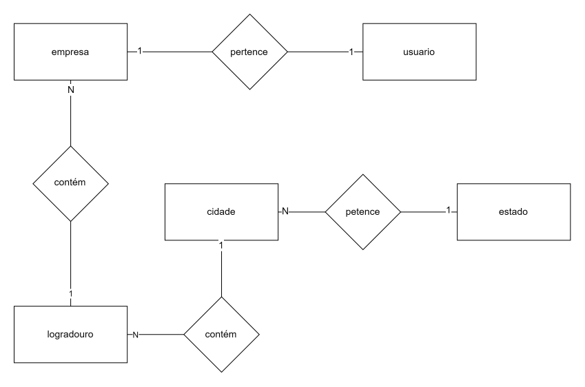

# Administrador de usuários


## Integrantes
- Luiza Nunes de Jesus - Banco de Dados
- Melissa de Oliveira Pecoraro - IA
- Pamella Schimalesky Engholm - Dotnet e QA
- Pedro Marques Pais Pavão  - Devops
- Roberto Menezes dos Santos - Java e Mobile

# JWT

A autenticação com JWT foi adicionada ao projeto!! \
Agora as rotas e os usuários precisam estar logados para acessar a aplicação \
A autenticação das rotas ocorre por meio do header de Authorization usando o padrão `Bearer [token]`, se atente aos espaços \
As rotas que necessitam de autenticação ou tem acesso restrito a um tipo de usuario estão informadas na [Documentação da API](#empresa) 


## Getting Started

Primeiro faça o download do projeto:
```
git clone https://github.com/RobertSDM/adm-usuarios
```

Após o download abra a pasta no seu IDE preferido, eu obtarei por usar o *IntelliJ*

Espere todas as dependencias serem baixadas. \
Com todas as depêndencias baixadas, adicione os dados para se conectar ao banco de dados MySQL no caminho:
```
/src/main/resources/application.properties
```

Quando depois executar aplicação pela primeira vez, você poderá comentar o comando
`spring.jpa.hibernate.ddl-auto=create` no application.properties

Agora com todas as configurações necessarias feitas, basta rodar o projeto.

## Diagramas

Diagrama de entidades \


Diagrama de relacionamento \


## Video descrevendo projeto
[Video de apresentação do projeto](https://youtu.be/z8PBH5MsTmo)

# Documentação API

## <a id="empresa"></a>Empresa /empresa
### Pricipais rotas
1. [Usuario](#usuario)
2. [Logradouro](#logradouro)
3. [Cidade](#cidade)
4. [Estado](#estado)
5. [Autenticação](#auth)
6. [Templates]()

`GET`

#### /find/all (todas as requisições)
| Código | Descrição                             |
|--------|---------------------------------------|
| 200    | Retorna todas as empresas registradas |
| 204    | Caso a lista de empresas esteja vazia |

#### /find/{id} (todas as requisições)
| Código | Descrição                                           |
|--------|-----------------------------------------------------|
| 200    | Retorna a empresa com o id enviado                  |
| 404    | Caso a empresa com o id enviado não seja encontrada |

`PUT`

#### /update/{id} (apenas ADMIN)
| Código | Descrição                                           |
|--------|-----------------------------------------------------|
| 200    | Retorna um json com a empresa atualizada            |
| 404    | Caso a empresa com o id enviado não seja encontrada |

`DELETE`

#### /delete/{id} (apenas ADMIN)
| Código | Descrição                                                        |
|--------|------------------------------------------------------------------|
| 204    | Caso a empresa seja deletada com sucesso                         |
| 404    | Caso a empresa com o id enviado não seja encontrada              | 

`PATCH`

#### /update/tel/{id}
| Código | Descrição                                           |
|--------|-----------------------------------------------------|
| 200    | Caso o tel seja atualizado com sucesso              |
| 404    | Caso a empresa com o id enviado não seja encontrada | 

#### /update/site/{id}
| Código | Descrição                                           |
|--------|-----------------------------------------------------|
| 200    | Caso o site seja atualizado com sucesso             |
| 404    | Caso a empresa com o id enviado não seja encontrada | 

## <a id="usuario"></a>Usuario /usuario
### Pricipais rotas
1. [Empresa](#empresa)
2. [Logradouro](#logradouro)
3. [Cidade](#cidade)
4. [Estado](#estado)
5. [Autenticação](#auth)

`GET`

#### /find/all (todas as requisições)
| Código | Descrição                             |
|--------|---------------------------------------|
| 200    | Retorna todos os usuarios registradas |
| 204    | Caso a lista de usuarios esteja vazia |

#### /find/{id} (todas as requisições)
| Código | Descrição                                           |
|--------|-----------------------------------------------------|
| 200    | Retorna o usuario com o id enviado                  |
| 404    | Caso o usuario com o id enviado não seja encontrado |

#### /create (apenas ADMIN)
| Código | Descrição                          |
|--------|------------------------------------|
| 201    | Retorna a empresa com o id enviado |

`PUT`

#### /update/{id} (apenas ADMIN)
| Código | Descrição                                           |
|--------|-----------------------------------------------------|
| 200    | Retorna um json com o usuario atualizado            |
| 404    | Caso o usuario com o id enviado não seja encontrado |

`DELETE`

### /delete/{id} (apenas ADMIN)
| Código | Descrição                                                        |
|--------|------------------------------------------------------------------|
| 204    | Caso a empresa seja deletada com sucesso                         |
| 404    | Caso a empresa com o id enviado não seja encontrada              | 

## <a id="logradouro"></a>Logradouro /logradouro
### Pricipais rotas
1. [Empresa](#empresa)
2. [Usuario](#usuario)
3. [Cidade](#cidade)
4. [Estado](#estado)
5. [Autenticação](#auth)

`GET`

#### /find/all (todas as requisições)
| Código | Descrição                                |
|--------|------------------------------------------|
| 200    | Retorna todos os logradouros registradas |
| 204    | Caso a lista de logradouros esteja vazia |

#### /find/{id} (todas as requisições)
| Código | Descrição                                              |
|--------|--------------------------------------------------------|
| 200    | Retorna o logradouro com o id enviado                  |
| 404    | Caso o logradouro com o id enviado não seja encontrado |

`PUT`

#### /update/{id} (apenas ADMIN)
| Código | Descrição                                              |
|--------|--------------------------------------------------------|
| 200    | Retorna um json com o logradouro atualizado            |
| 404    | Caso o logradouro com o id enviado não seja encontrado |

## <a id="cidade"></a>Cidade /cidade
### Principals rotas
1. [Empresa](#empresa)
2. [Usuario](#usuario)
3. [Logradouro](#logradouro)
4. [Estado](#estado)
5. [Autenticação](#auth)

`GET`

#### /find/all (todas as requisições)
| Código | Descrição                            |
|--------|--------------------------------------|
| 200    | Retorna todas as cidades registradas |
| 204    | Caso a lista de cidades esteja vazia |


#### /find/{id} (todas as requisições)
| Código | Descrição                                          |
|--------|----------------------------------------------------|
| 200    | Retorna a cidade com o id enviado                  |
| 404    | Caso a cidade com o id enviado não seja encontrada |

`PUT`

#### /update/{id} (apenas ADMIN)
| Código | Descrição                                          |
|--------|----------------------------------------------------|
| 200    | Retorna um json com a cidade atualizada            |
| 404    | Caso a cidade com o id enviado não seja encontrada |

## <a id="estado"></a>Estado /estado
### Pricipais rotas
1. [Empresa](#empresa)
2. [Usuario](#usuario)
3. [Logradouro](#logradouro)
4. [Cidade](#cidade)
5. [Autenticação](#auth)

`GET`

#### /find/all (todas as requisições)
| Código | Descrição                            |
|--------|--------------------------------------|
| 200    | Retorna todos os estados registradas |
| 204    | Caso a lista de estados esteja vazia |

#### /find/{id} (todas as requisições)
| Código | Descrição                                          |
|--------|----------------------------------------------------|
| 200    | Retorna o estado com o id enviado                  |
| 404    | Caso o estado com o id enviado não seja encontrado |

`PUT`

#### /update/{id} (apenas ADMIN)
| Código | Descrição                                          |
|--------|----------------------------------------------------|
| 200    | Retorna um json com o estado atualizado            |
| 404    | Caso o estado com o id enviado não seja encontrado |

## <a id="auth"></a> Autenticação /auth
### Pricipais rotas
1. [Empresa](#empresa)
2. [Usuario](#usuario)
3. [Logradouro](#logradouro)
4. [Cidade](#cidade)
5. [Estado](#estado)

`POST`

#### /register (apenas ADMIN)
| Código | Descrição                          |
|--------|------------------------------------|
| 201    | Retorna a empresa com o id enviado |

#### /login (apenas ADMIN)
| Código | Descrição                                          |
|--------|----------------------------------------------------|
| 200    | Retorna um json com o estado atualizado            |

## <a id="template_home"></a>Template Home 

`GET`

#### /
| Código | Descrição             |
|--------|-----------------------|
| 200    | Retorna a pagina home |

#### /adm/empresa/deletar/{id}
| Código | Descrição                      |
|--------|--------------------------------|
| 200    | Redireciona para a página home |

## <a id="template_criar_empresa"></a>Template Criar Empresa

`GET`

#### /criar-empresa
| Código | Descrição                      |
|--------|--------------------------------|
| 200    | Retorna a pagina criar_empresa |

`POST`

#### /inserir-empresa
| Código | Descrição                                                     |
|--------|---------------------------------------------------------------|
| 200    | Redireciona para a página a url "/"                           |
| 200    | Caso de erro ao validar a página com os erros                 |
| 200    | Caso caia em um try catch retorna para a página criar_empresa |
